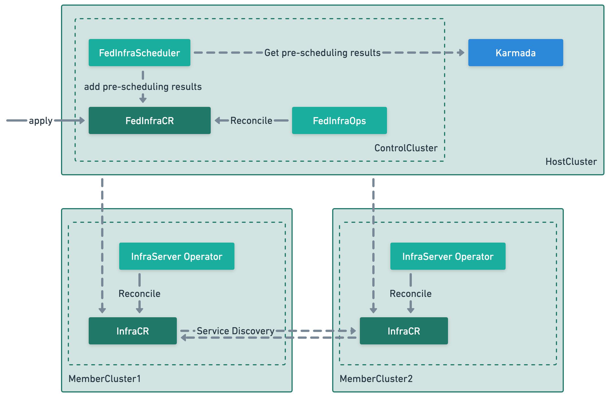
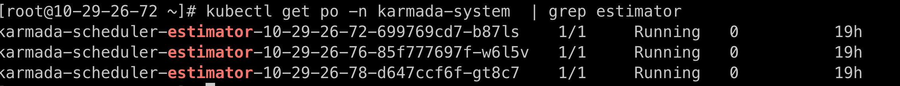
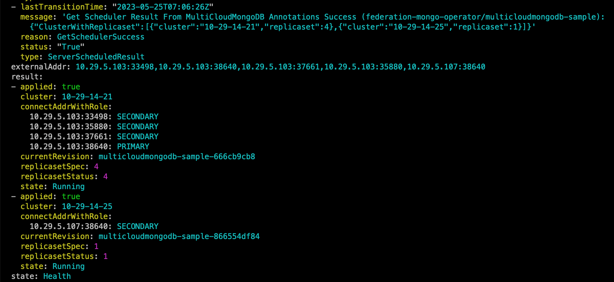

# FedState

[**English**](./README.md) | **简体中文**

FedState 指的是 Federation Stateful Service，主要的设计目标是为了解决在多云、
多集群、多数据中心的场景下，有状态服务的编排、调度、部署和自动化运维等能力。

## 概述

FedState 对需要部署在多云环境上的中间件、数据库等有状态的服务通过 Karmada
下发到各个成员集群，使其正常工作的同时并提供一些高级运维能力。

## 架构



组件说明：

- FedStateScheduler: 多云有状态服务调度器，在 Karmada 调度器的基础上，
  添加了一些与中间件服务相关的调度策略。
- FedState：多云有状态服务控制器主要负责按需配置各个管控集群与通过 Karmada 分发。
- Member Operator：表示部署在管控平面的有状态服务 Operator，
  FedState 内置了 Mongo Operator，后续会支持更多的有状态服务。
- FedStateCR：表示多云有状态服务实例的一个概念。
- FedStateCR-Member：表示多云有状态服务被下发到管控平面的实例。

### FedState 目前能力（以接入 MongoDB Operator 为例）

- 多云 MongoDB 的增删改查
- 多云 MongoDB 扩缩容
- 多云 MongoDB 故障转移
- 多云 MongoDB 配置更新，自定配置
- 多云 MongoDB 资源更新

## 快速开始

大致步骤为：部署 FedState 至 Karmada Host 集群，部署 Member Operator 至成员集群，
在控制面创建 FedStateCR，等待创建成功直到可以对外提供服务。

### 先决条件

- Kubernetes v1.16+
- Karmada v1.4+
- 存储服务
- 集群 VIP

### 环境准备及 Karmada 安装

1. 准备不少于两个 Kubernetes 集群。
2. 使用 Keepalived，HAProxy 等服务分别管理两个集群的 VIP。
3. 部署 Karmada：[https://karmada.io/docs/installation/](https://karmada.io/docs/installation/)。

### FedState 安装（以 MongoDB 为例）

> 说明：
>
> - Karmada Host：指的是部署 Karmada 组件的集群。
> - Karmada Control：指的是与 Karmada Apiserver 交互的 Karmada 控制面。

1. （可选）在 Karmada Host 集群，检查所纳管的成员集群是否部署了 estimator。

   

   如果没有开启 estimator，则调度器无法预估多云有状态服务资源设置能否被管控平面满足。

   （可选）开启 estimator。memberClusterName 是想要开启 estimator 的成员集群名称：

   ```shell
   karmadactl addons enable  karmada-scheduler-estimator  -C {memberClusterName}
   ```

   （可选）检查 estimator service 的名称是否符合以 estimator-{clusterName} 为后缀。

2. 在 Karmada Control 上部署自定义资源解释器：

   ```shell
   kubectl apply -f customresourceinterpreter/pkg/deploy/customization.yaml
   ```

3. 在 Karmada Host 集群上部署控制面服务：

   ```shell
   kubectl create ns {your-namespace}
   kubectl create secret generic kubeconfig --from-file=/root/.kube/config -n {your-namespace} 

   # 在 kubeconfig 查看 Karmada ApiServer 名称
   kubectl config get-contexts

   # 在 kubeconfig 查看 Karmada ApiServer 名称
   vim config/manager/manager.yaml
   kubectl apply -f config/webhook/secret.yaml -n {your-namespace}
   kubectl apply -k config/deploy_contorlplane/. -n {your-namespace}
   ```

4. 在 Karmada Control 上部署 webhook 以及控制面 CRD：

   ```shell
   kubectl label cluster <成员cluster名称> VIP=<成员集群对应的VIP>
   kubectl apply -f config/webhook/external-svc.yaml
   kubectl apply -f config/crd/bases/.
   ```

5. 在 Karmada Host 集群部署调度器：

   ```shell
   # 在 kubeconfig 查看 Karmada Host Apiserver 的名称以及
   # Karmada Apiserver 的名称和 karmada Host 的 VIP 地址
   
   vim config/artifacts/deploy/deployment.yaml

   # 修改以下启动参数为上面的值 

   - --karmada-context=<karmada>
   - --host-context=<10-29-14-21>
   - --host-VIP-address=<10.29.5.103>
   ```

6. 在 Member Cluster 上部署数据面控制器：

   ```shell
   kubectl apply -f config/crd/bases/mongodbs.yaml -n {your-namespace}
   kubectl apply -k config/deploy_dataplane/.
   ```

7. 在控制面部署 MultiCloudMongoDB：

   ```shell
   kubectl apply -f config/sample/samples.yaml
   ```

   `sample.yaml` 文件的内容类似于：

   ```yaml
   apiVersion: middleware.fedstate.io/v1alpha1
   kind: MultiCloudMongoDB
   metadata:
     name: multicloudmongodb-sample
   spec:
     # 副本数
     replicaset: 5
     # 监控配置
     export:
       enable: false
     # 资源配置
     resource:
       limits:
         cpu: "2"
         memory: 512Mi
       requests:
         cpu: "1"
         memory: 512Mi
     # 存储配置
     storage:
       storageClass: managed-nfs-storage
       storageSize: 1Gi
     # 镜像配置
     imageSetting:
       image: mongo:3.6
       imagePullPolicy: Always
   ```

8. 查看 MultiCloudMongoDB 状态以及各个被管控集群上 MongoDB 状态：

   

   使用 externalAddr 地址连接 MongoDB 副本集。
